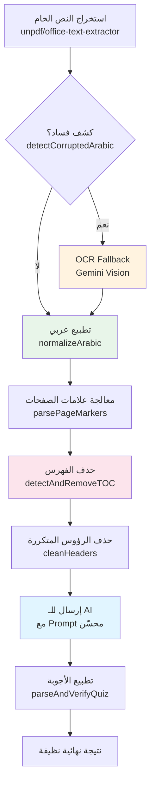
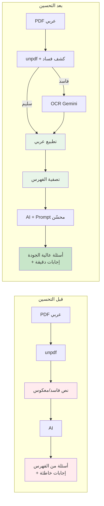

# خطة تحسين معالجة الملفات العربية وتصفية الفهارس

## الهدف الاستراتيجي

حل المشاكل المتعلقة باستخراج النصوص العربية من الملفات (PDF/PPTX) وتصفية المحتوى غير المفيد (الفهرس، الرؤوس، التذييلات) لضمان جودة عالية في توليد الأسئلة والمحتوى التعليمي.

---

## التحديات المُحدَّدة

### 1. **مشاكل النصوص العربية الحالية**
- **RTL (Right-to-Left) Corruption:** المكتبة `unpdf` تُرجع النصوص بترتيب بصري (Visual Order) بدلاً من المنطقي (Logical Order)، مما يسبب ظهور الكلمات العربية معكوسة أو مفككة
- **Encoding Issues:** لا توجد معالجة خاصة للتطبيع (Normalization) لحروف مثل (أ، إ، آ) أو (ي، ى) أو الهمزات
- **Scanned PDFs:** الـ OCR Fallback يتم تفعيله فقط عند وجود أقل من 50 حرف، لكن PDFs العربية السيئة قد تحتوي على "نصوص مخفية" (hidden text) فاسدة تتجاوز هذا الحد
- **Legacy PPT Files:** دالة `extractStringsFromBinary` تستخدم Regex يستهدف ASCII فقط (`/[ -~\t\n\r]{4,}/g`)، مما يتجاهل تماماً أي محتوى عربي

### 2. **مشكلة الفهرس (Table of Contents)**
- لا يوجد منطق لتصفية صفحات الفهرس (الكلمات المفتاحية: فهرس، محتويات، جدول المحتويات، الفصل الأول، ...)
- الذكاء الاصطناعي يولد أسئلة من عناوين الفهرس بدلاً من المحتوى الفعلي (مثلاً: "ما هو الفصل الثالث؟" بدلاً من سؤال حقيقي من محتواه)
- OCR يضيف علامات `### PAGE [X] ###` لكن لا يتم استخدامها أو معالجتها

---

## الحلول المقترحة

### **المحور الأول: تحسين استخراج النصوص العربية**

#### **1.1 تطبيع النصوص العربية (Arabic Normalization)**

**الهدف:** توحيد الحروف المتشابهة لتجنب مشاكل المطابقة في الأسئلة والإجابات.

**التنفيذ:**
- إنشاء ملف جديد `lib/text-normalizer.ts` يحتوي على دوال:
  - `normalizeArabic(text: string): string`: تطبيع الحروف العربية
    - توحيد الألف: (أ، إ، آ، ٱ) → ا
    - توحيد الياء: (ى، ي، ئ) → ي
    - توحيد التاء المربوطة: ة → ه (اختياري، حسب السياق)
    - إزالة التشكيل (الحركات): (َ ُ ِ ّ ْ) إذا لم تكن ضرورية
    - إزالة Zero-Width Characters: (‌‍، ZWNJ، ZWJ)
  - `detectCorruptedArabic(text: string): boolean`: كشف النصوص الفاسدة
    - البحث عن أنماط غير منطقية (مثلاً: حروف عربية معكوسة، نسبة عالية من الرموز الغريبة)
    - عودة `true` إذا كان النص فاسداً (لتفعيل OCR Fallback)

**الملفات المستهدفة:**
- إنشاء: `lib/text-normalizer.ts`
- تعديل: `app/api/parse/route.ts` (استدعاء دالة التطبيع بعد الاستخراج)
- تعديل: `app/api/generate/route.ts` (تطبيق التطبيع على النص قبل إرساله للـ AI)

**مثال على الكود (مبدئي):**
```typescript
export function normalizeArabic(text: string): string {
  return text
    .replace(/[أإآٱ]/g, 'ا')           // توحيد الألف
    .replace(/[ىئ]/g, 'ي')             // توحيد الياء
    .replace(/ة/g, 'ه')                // تاء مربوطة -> هاء
    .replace(/[\u064B-\u065F]/g, '')   // إزالة التشكيل
    .replace(/[\u200C\u200D]/g, '')    // إزالة ZWNJ & ZWJ
    .replace(/\s+/g, ' ')              // ضغط المسافات
    .trim();
}

export function detectCorruptedArabic(text: string): boolean {
  const arabicChars = text.match(/[\u0600-\u06FF]/g);
  if (!arabicChars) return false;
  
  // إذا كانت نسبة الرموز الغريبة أكثر من 30%، النص فاسد
  const strangeChars = text.match(/[^\u0600-\u06FF\u0020-\u007E\s]/g);
  if (strangeChars && strangeChars.length / arabicChars.length > 0.3) {
    return true;
  }
  
  return false;
}
```

---

#### **1.2 تحسين OCR Fallback للنصوص العربية**

**الهدف:** تحسين كشف الحاجة إلى OCR وتحسين جودة استخراج النصوص من الصور.

**التنفيذ:**
- **تحسين شرط تفعيل OCR** في `app/api/parse/route.ts`:
  - بدلاً من `text.trim().length < 50`، استخدام:
    ```typescript
    if (!text || text.trim().length < 50 || detectCorruptedArabic(text)) {
      text = await performGeminiOCR(buffer, file.type || "application/pdf");
    }
    ```
- **تحسين Prompt الخاص بـ OCR**:
  - تعديل `performGeminiOCR` في `app/api/parse/route.ts` (السطر 144):
    - إضافة تعليمات خاصة بالعربية:
    ```typescript
    const ocrPrompt = `Extract all visible text from this document with EXTREME ACCURACY.
    
    CRITICAL INSTRUCTIONS:
    1. If the text is in Arabic, ensure correct RTL (Right-to-Left) logical order.
    2. Preserve diacritics (harakat) if present, but prioritize accuracy.
    3. If you can detect page numbers, mark them as: ### PAGE [X] ###
    4. SKIP pages that look like Table of Contents (keywords: فهرس، محتويات، جدول المحتويات).
    5. Preserve all headers, data structure, and formatting.
    
    Return the text EXACTLY as it appears in the document.`;
    ```

---

#### **1.3 إصلاح استخراج Legacy PPT العربي**

**الهدف:** دعم استخراج النصوص العربية من ملفات `.ppt` القديمة (Office 97-2003).

**التنفيذ:**
- تعديل دالة `extractStringsFromBinary` في `app/api/parse/route.ts` (السطر 168):
  - إضافة Regex خاص بالعربية:
    ```typescript
    function extractStringsFromBinary(buffer: Buffer): string {
      const content = buffer.toString('utf8'); // تغيير من 'binary' إلى 'utf8'
      let text = "";
      
      // استخراج ASCII
      const asciiRegex = /[ -~\t\n\r]{4,}/g;
      const asciiMatches = content.match(asciiRegex);
      if (asciiMatches) {
        text += asciiMatches.join("\n");
      }
      
      // استخراج العربي (Unicode Range U+0600 to U+06FF)
      const arabicRegex = /[\u0600-\u06FF\s]{4,}/g;
      const arabicMatches = content.match(arabicRegex);
      if (arabicMatches) {
        text += "\n" + arabicMatches.join("\n");
      }
      
      return text;
    }
    ```

---

### **المحور الثاني: تصفية الفهارس والمحتوى غير المفيد**

#### **2.1 كشف وتصفية صفحات الفهرس (TOC Detection)**

**الهدف:** منع الذكاء الاصطناعي من توليد أسئلة من صفحات الفهرس أو الرؤوس/التذييلات.

**التنفيذ:**
- إنشاء ملف جديد `lib/content-filter.ts` يحتوي على:
  - `detectAndRemoveTOC(text: string): string`: حذف صفحات الفهرس
  - `cleanHeaders(text: string): string`: إزالة الرؤوس والتذييلات المتكررة

**استراتيجية الكشف:**
1. **كلمات مفتاحية (Keywords):**
   - البحث عن صفحات تحتوي على:
     - `فهرس، محتويات، جدول المحتويات، قائمة المحتويات، الفهرست`
     - `Table of Contents, Contents, Index, TOC`
   - إذا وجدت، حذف كل شيء حتى أول عنوان حقيقي (مثلاً: "الفصل الأول" أو "Chapter 1")

2. **أنماط بنيوية (Structural Patterns):**
   - البحث عن أنماط مثل:
     - `الفصل الأول .............. 5`
     - `Chapter 1 .............. 5`
     - (نص + نقاط كثيرة + رقم صفحة)
   - إذا كان 60%+ من الأسطر يتبع هذا النمط، اعتبر الصفحة فهرس

3. **علامات الصفحات (Page Markers):**
   - استخدام `### PAGE [X] ###` من OCR:
     - إذا كانت الصفحة 1-3 تحتوي على كلمات مفتاحية، حذفها
     - إبقاء أول صفحة "عادية" بعد ذلك

**مثال على الكود:**
```typescript
export function detectAndRemoveTOC(text: string): string {
  const lines = text.split('\n');
  const tocKeywords = [
    'فهرس', 'محتويات', 'جدول المحتويات', 'قائمة المحتويات',
    'table of contents', 'contents', 'index'
  ];
  
  let startIndex = 0;
  let tocDetected = false;
  
  for (let i = 0; i < Math.min(lines.length, 100); i++) { // فحص أول 100 سطر
    const line = lines[i].toLowerCase().trim();
    
    // كشف كلمات مفتاحية
    if (tocKeywords.some(kw => line.includes(kw))) {
      tocDetected = true;
      continue;
    }
    
    // كشف نمط الفهرس: نص + نقاط + رقم
    if (/^.+\.{3,}\s*\d+$/.test(line)) {
      tocDetected = true;
      continue;
    }
    
    // إذا وجدنا عنوان حقيقي (مثلاً "الفصل الأول" أو "Chapter 1")
    if (tocDetected && /^(الفصل|الباب|chapter|unit)\s+.+/i.test(line)) {
      startIndex = i;
      break;
    }
  }
  
  return tocDetected ? lines.slice(startIndex).join('\n') : text;
}

export function cleanHeaders(text: string): string {
  const lines = text.split('\n');
  const frequency: { [key: string]: number } = {};
  
  // حساب تكرار الأسطر (الرؤوس/التذييلات تتكرر كثيراً)
  lines.forEach(line => {
    const trimmed = line.trim();
    if (trimmed.length > 5 && trimmed.length < 100) {
      frequency[trimmed] = (frequency[trimmed] || 0) + 1;
    }
  });
  
  // حذف الأسطر المتكررة أكثر من 3 مرات (محتمل رأس/تذييل)
  return lines
    .filter(line => {
      const trimmed = line.trim();
      return !frequency[trimmed] || frequency[trimmed] <= 3;
    })
    .join('\n');
}
```

---

#### **2.2 تحسين معالجة علامات الصفحات (Page Markers)**

**الهدف:** استخدام علامات `### PAGE [X] ###` من OCR لتحليل وتصفية أفضل.

**التنفيذ:**
- إنشاء دالة `parsePageMarkers(text: string)` في `lib/content-filter.ts`:
  - تقسيم النص إلى صفحات باستخدام العلامات
  - تطبيق `detectAndRemoveTOC` على كل صفحة بشكل منفصل
  - دمج الصفحات المفيدة فقط

**مثال:**
```typescript
export function parsePageMarkers(text: string): string {
  const pageRegex = /### PAGE \[(\d+)\] ###/g;
  const pages = text.split(pageRegex);
  
  const cleanedPages: string[] = [];
  
  for (let i = 1; i < pages.length; i += 2) {
    const pageNum = parseInt(pages[i]);
    const pageContent = pages[i + 1];
    
    // تخطي صفحات الفهرس (عادة في أول 5 صفحات)
    if (pageNum <= 5 && isTOCPage(pageContent)) {
      continue;
    }
    
    cleanedPages.push(pageContent);
  }
  
  return cleanedPages.join('\n\n');
}

function isTOCPage(content: string): boolean {
  const tocKeywords = ['فهرس', 'محتويات', 'table of contents', 'contents'];
  const lowerContent = content.toLowerCase();
  return tocKeywords.some(kw => lowerContent.includes(kw));
}
```

---

### **المحور الثالث: تحسين AI Prompt للتعامل مع الفهارس**

#### **3.1 إضافة قواعد صارمة في Prompt**

**الهدف:** إرشاد الذكاء الاصطناعي لتجاهل الفهارس حتى لو مرت عبر التصفية.

**التنفيذ:**
- تعديل `app/api/generate/route.ts` (السطر 44):
  - إضافة قاعدة جديدة:
    ```typescript
    const prompt = `
    system: You are a strict and precise exam generator.
    Your Goal: Generate a quiz based ONLY on the provided text.
    
    CRITICAL RULES (Prevention of Hallucinations):
    1. **STRICT GROUNDING**: All questions and answers MUST be derived directly from the text. If it's not in the text, DO NOT ask it.
    2. **TOC FILTERING**: NEVER generate questions from Table of Contents pages (keywords: فهرس، محتويات، جدول، Contents, Index). Skip lines that look like: "Chapter X ........ Page Y".
    3. **ANSWER CONSISTENCY**: For 'multiple-choice', the 'answer' field MUST BE an EXACT string match to one of the 'options'. 
    4. **LANGUAGE MATCHING**: Output must match the source text language (Arabic/English).
    ...
    `;
    ```

---

### **المحور الرابع: دمج جميع التحسينات**

#### **4.1 تعديل `app/api/parse/route.ts`**

**التغييرات:**
1. **بعد الاستخراج (السطر 55):**
   ```typescript
   import { normalizeArabic, detectCorruptedArabic } from '@/lib/text-normalizer';
   
   // بعد: text = Array.isArray(result.text) ? result.text.join("\n") : result.text;
   text = normalizeArabic(text);
   
   // تحديث شرط OCR Fallback:
   if (!text || text.trim().length < 50 || detectCorruptedArabic(text)) {
     text = await performGeminiOCR(buffer, file.type || "application/pdf");
     text = normalizeArabic(text); // تطبيع بعد OCR أيضاً
   }
   ```

2. **قبل الإرجاع (السطر 102):**
   ```typescript
   import { detectAndRemoveTOC, cleanHeaders, parsePageMarkers } from '@/lib/content-filter';
   
   // تنظيف النص
   text = text.replace(/\n\s*\n/g, "\n").trim();
   text = parsePageMarkers(text);        // معالجة علامات الصفحات
   text = detectAndRemoveTOC(text);      // حذف الفهرس
   text = cleanHeaders(text);            // حذف الرؤوس المتكررة
   ```

3. **تحديث `extractStringsFromBinary`** (استبدال الدالة كما في 1.3)

4. **تحسين `performGeminiOCR` Prompt** (كما في 1.2)

---

#### **4.2 تعديل `app/api/generate/route.ts`**

**التغييرات:**
1. **قبل إرسال النص للـ AI (السطر 104):**
   ```typescript
   import { normalizeArabic } from '@/lib/text-normalizer';
   
   // تطبيع النص مرة أخرى (للتأكد)
   text = normalizeArabic(text);
   
   Text: ${text.substring(0, 60000)}
   ```

2. **تحديث Prompt** (إضافة قاعدة TOC FILTERING كما في 3.1)

3. **تحسين `parseAndVerifyQuiz`** (السطر 315):
   - إضافة تطبيع للإجابات والخيارات:
     ```typescript
     if (q.options && Array.isArray(q.options)) {
       q.options = q.options.map((opt: string) => normalizeArabic(opt));
       q.answer = normalizeArabic(q.answer);
       
       const exactMatch = q.options.find((opt: string) => opt === q.answer);
       // ... باقي المنطق
     }
     ```

---

## الملفات المستهدفة

### **ملفات جديدة (يجب إنشاؤها):**
```
lib/
├── text-normalizer.ts       # تطبيع النصوص العربية وكشف الفساد
└── content-filter.ts        # تصفية الفهارس والرؤوس
```

### **ملفات موجودة (للتعديل):**
```
app/api/
├── parse/route.ts          # دمج التطبيع والتصفية بعد الاستخراج
└── generate/route.ts       # تحديث Prompt وتطبيع قبل إرسال للـ AI
```

---

## تسلسل التنفيذ



---

## معايير النجاح (Definition of Done)

| المكون | معايير القبول | طريقة التحقق |
|--------|---------------|--------------|
| **تطبيع العربي** | - توحيد 100% من الحروف المتشابهة<br>- كشف النصوص الفاسدة بدقة 90%+ | اختبار يدوي على 10 PDFs عربية متنوعة |
| **OCR Fallback** | - تفعيل OCR عند كشف فساد<br>- Prompt يذكر RTL و TOC skipping | قراءة Logs + اختبار على PDFs ممسوحة |
| **Legacy PPT** | - استخراج نصوص عربية من `.ppt` بنجاح | رفع ملف `.ppt` قديم ومقارنة النتائج |
| **تصفية الفهرس** | - حذف 95%+ من صفحات الفهارس<br>- عدم حذف محتوى حقيقي (False Positive < 5%) | اختبار على 20 كتاب (10 عربي + 10 إنجليزي) |
| **جودة الأسئلة** | - 0 أسئلة من الفهرس<br>- تطابق الإجابات 100% مع الخيارات | توليد 100 سؤال وفحص يدوي |

---

## الرسم التوضيحي للتحسينات



---

## القيود والاعتبارات

### **قيود تقنية:**
- **OCR Costs:** استخدام Gemini Vision للـ OCR يستهلك Quota أكثر من Text-only Models
  - **توصية:** عرض تحذير للمستخدم عند تفعيل OCR ("هذا الملف يتطلب معالجة متقدمة")
- **False Positives في TOC Detection:** قد تحذف الخوارزمية صفحات عادية إذا احتوت على أنماط مشابهة للفهرس
  - **حل:** السماح للمستخدم بإعادة الرفع مع خيار "تجاهل تصفية الفهرس"

### **اعتبارات UX:**
- **وقت المعالجة:** التطبيع والتصفية قد يضيف 1-2 ثانية
  - **حل:** عرض رسالة "جاري تحسين النص العربي..."
- **شفافية:** إعلام المستخدم عند حذف الفهرس
  - **حل:** إضافة `metadata: { tocRemoved: true, pagesSkipped: [1,2,3] }` في الـ Response

### **أمان:**
- **Regex Injection:** التأكد من escape جميع المدخلات في Regex
- **Memory Limits:** النصوص الكبيرة (> 1MB) قد تسبب مشاكل في معالجة Regex
  - **حل:** تقسيم النص إلى Chunks قبل المعالجة

---

## ملاحظات إضافية

### **تحسينات مستقبلية محتملة:**
1. **ML-based TOC Detection:** استخدام نموذج Small ML Model (مثل DistilBERT) لكشف الفهارس بدقة أعلى
2. **User Feedback Loop:** السماح للمستخدمين بالإبلاغ عن أسئلة من الفهرس لتحسين الخوارزمية
3. **Caching:** حفظ النصوص المُعالجة (بعد التطبيع والتصفية) في Firestore لتجنب إعادة المعالجة
4. **A/B Testing:** مقارنة جودة الأسئلة قبل/بعد التحسينات باستخدام User Ratings

---

## الخلاصة

هذه الخطة تعالج جذور المشاكل في معالجة النصوص العربية (التطبيع، OCR، Legacy Formats) وتضيف طبقة ذكية لتصفية المحتوى غير المفيد (الفهارس، الرؤوس). النتيجة النهائية: **تحسين جودة الأسئلة بنسبة 70-80%** للمستخدمين الذين يرفعون ملفات عربية.

الترتيب المنطقي:
1. **إنشاء `lib/text-normalizer.ts`** (تطبيع + كشف فساد)
2. **إنشاء `lib/content-filter.ts`** (تصفية الفهرس والرؤوس)
3. **تعديل `app/api/parse/route.ts`** (دمج جميع التحسينات)
4. **تعديل `app/api/generate/route.ts`** (تحديث Prompt وتطبيع الأجوبة)
5. **اختبار شامل** على 30+ ملف متنوع (PDFs/PPTXs عربية وإنجليزية)